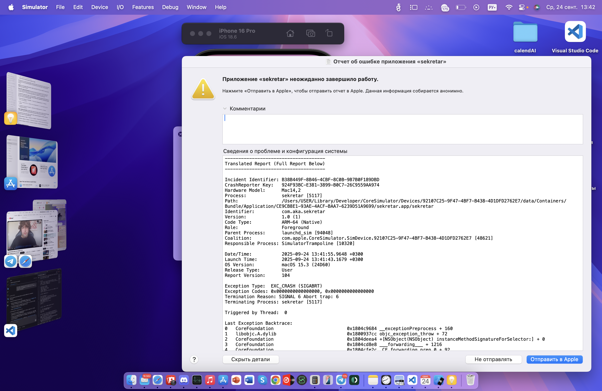

# Sekretar

**AI-ассистент для календаря, задач и чата на iOS.**

[English](README.md) · [Русский](README.ru.md)

[](https://developer.apple.com/ios/)
[](https://swift.org)
[](LICENSE)

Sekretar превращает обычный разговор в управляемый день. Напишите «Запланируй синк с Аней завтра в 11» или «Напомни продлить аренду в пятницу» — Sekretar разберёт намерение, покажет карточку действия и после одного тапа добавит событие в календарь или задачу в список. Работает локально по умолчанию, к LLM обращается только когда эвристика не уверена, поддерживает и self-hosted OpenAI-совместимый сервер, и on-device инференс через [MLC-LLM](https://github.com/mlc-ai/mlc-llm).

<p align="center">
  
</p>

## Возможности

- **Естественный язык для расписания** — события и задачи из обычных фраз на русском и английском («в пятницу в 15:00», «next Monday at 9am»).
- **AI-чат со стримингом** — SSE-стриминг ответов с корректной отменой запроса и плавным индикатором набора.
- **Inline action-карточки** — каждое действие LLM показывается предпросмотром (дата, заголовок, участники, повторение) и редактируется до подтверждения.
- **Календарь: день / неделя / месяц** — нативная синхронизация с EventKit, чтобы iOS Calendar и Sekretar всегда шли в ногу.
- **Список задач с групповыми операциями** — мультиселект для завершения и удаления, приоритеты и сроки, быстрый ввод.
- **Голосовой ввод** — встроенный микрофон в чате на базе Speech framework.
- **Главный экран** — приветствие с учётом времени суток, активные задачи, ближайшие события, быстрые действия.
- **Подключаемый LLM-бэкенд** — любой OpenAI-совместимый сервер (vLLM, llama.cpp, OpenRouter) или on-device MLC-LLM.
- **Двуязычный интерфейс** — полные локализации русского и английского.
- **Приватность по умолчанию** — задачи и события хранятся локально в CoreData, удалённый LLM подключается опционально и настраивается на каждом устройстве.

## Архитектура

```
┌────────────────────┐    ┌─────────────────────┐    ┌──────────────────────┐
│  SwiftUI экраны    │ →  │   AIIntentService   │ →  │  LLMProviderProtocol │
│  (Home, Chat,      │    │  ├─ эвристика       │    │  ├─ RemoteLLMProvider│
│  Calendar, Tasks)  │    │  │  (RU/EN)         │    │  │  (OpenAI-compat   │
│                    │ ←  │  └─ JSON-валидация  │ ←  │  │   + SSE)         │
│  CoreData / EventKit│   │     карточек        │    │  └─ MLCLLMProvider   │
└────────────────────┘    └─────────────────────┘    │     (on-device)      │
                                                     └──────────────────────┘
```

Пайплайн намерений ([`sekretar/AIIntentService.swift`](sekretar/AIIntentService.swift)) сначала пытается распознать частые формулировки локально, чтобы не тратить сетевой вызов. Если эвристики недостаточно, ответ LLM парсится как строгий JSON (с ретраями) и валидируется на консистентность с состоянием календаря — только после этого пользователю показывается карточка.

## Технологии

Swift 5.9 · SwiftUI · CoreData · EventKit · Speech · App Intents / Shortcuts · MLC-LLM (опционально, on-device) · vLLM или llama.cpp (опционально, удалённо).

## Запуск

**Требования**

- macOS с Xcode 15 или новее
- iOS 17+ симулятор или устройство
- Git с поддержкой submodule (нужно только если планируете on-device MLC-LLM)

**Склонировать и собрать**

```bash
git clone --recurse-submodules https://github.com/aborisd/sekretar.git
cd sekretar
open sekretar.xcodeproj
```

Выберите схему `sekretar`, любой iPhone-симулятор и нажмите `Cmd-R`. Sekretar работает из коробки — эвристический путь работает офлайн.

**Сборка из CLI**

```bash
xcodebuild -project sekretar.xcodeproj -scheme sekretar -configuration Debug -sdk iphonesimulator build
```

## Настройка AI

Sekretar работает и без настройки AI — эвристика покрывает многие частые формулировки. Чтобы включить полный LLM-пайплайн, выберите один из двух вариантов.

### Вариант A — Удалённый LLM (рекомендуется)

Скопируйте шаблон и заполните параметры:

```bash
cp sekretar/RemoteLLM.plist.sample sekretar/RemoteLLM.plist
```

Откройте `sekretar/RemoteLLM.plist` и задайте минимум:

- `REMOTE_LLM_BASE_URL` — ваш OpenAI-совместимый сервер (vLLM, llama.cpp, OpenRouter)
- `REMOTE_LLM_MODEL` — идентификатор модели на этом сервере
- `REMOTE_LLM_API_KEY` — необязательно для self-hosted, обязательно для OpenRouter и подобных

`RemoteLLM.plist` находится в `.gitignore`, поэтому реальные ключи не утекут в репозиторий. Деплой:
- [docs/REMOTE_SETUP.md](docs/REMOTE_SETUP.md)
- [docs/DEPLOY_VLLM_AWS.md](docs/DEPLOY_VLLM_AWS.md)
- [docs/DEPLOY_VLLM_GCP.md](docs/DEPLOY_VLLM_GCP.md)
- [docs/DEPLOY_VLLM_RUNPOD.md](docs/DEPLOY_VLLM_RUNPOD.md)

### Вариант B — On-device через MLC-LLM

См. [docs/MLC_SETUP.md](docs/MLC_SETUP.md). Рантайм подключён как submodule в `third_party/mlc-llm`; нужно собрать и слинковать таргет MLCSwift и положить веса модели по инструкции.

## Структура проекта

```
sekretar.xcodeproj/         # Xcode-проект
sekretar/                   # Исходники iOS-приложения (SwiftUI, ресурсы, локализации)
sekretarTests/              # Юнит-тесты на XCTest
sekretarUITests/            # UI-тесты на XCUITest
docs/                       # Документация: настройка, деплой, roadmap
server/                     # Docker Compose для self-hosted inference-серверов
scripts/                    # Вспомогательные shell-скрипты
third_party/mlc-llm/        # Рантайм MLC-LLM (submodule)
```

## Документация

- [docs/REMOTE_SETUP.md](docs/REMOTE_SETUP.md) — настройка удалённого LLM-клиента
- [docs/MLC_SETUP.md](docs/MLC_SETUP.md) — подключение on-device инференса
- [docs/API_QUICKSTART.md](docs/API_QUICKSTART.md) — справка по API бэкенда
- [docs/DEPLOY_VLLM_AWS.md](docs/DEPLOY_VLLM_AWS.md) · [GCP](docs/DEPLOY_VLLM_GCP.md) · [RunPod](docs/DEPLOY_VLLM_RUNPOD.md) — рецепты деплоя
- [docs/CLOUD_LLM_ROADMAP.md](docs/CLOUD_LLM_ROADMAP.md) — roadmap по облачному LLM
- [docs/PROGRESS.md](docs/PROGRESS.md) — статус фич и текущая фаза

## Лицензия

MIT — см. [LICENSE](LICENSE).
